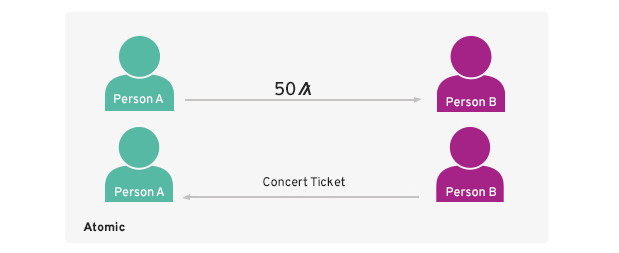
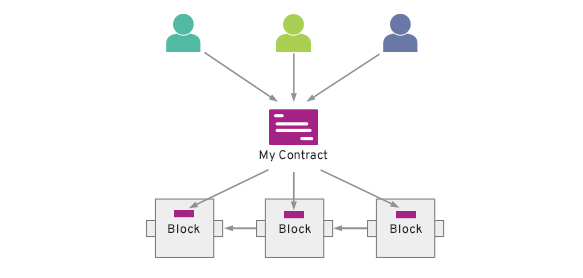
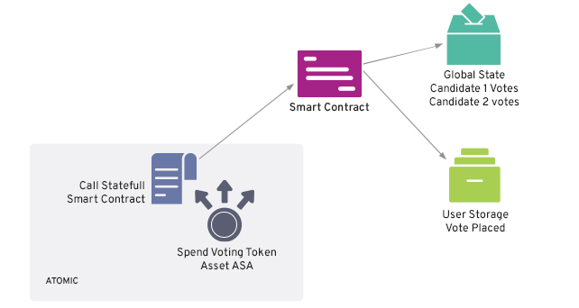
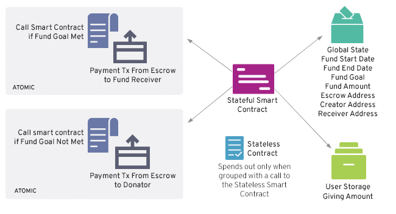

title: 4. Building Applications

Algorand supplies a suite of new technologies, built as part of the core Algorand blockchain protocol, that enable all types of developers to build more efficient, secure, and trustless applications as well as invent brand new real-world applications. These technologies solve many problems in their standalone form, but they can also be composed together in multiple ways to produce sophisticated, production applications that can solve complex real-world problems. For example, a developer can create their own token ([Algorand Standard Asset](../features/asa.md)) in a single transaction that can then be traded like any other asset on Algorand. Combine this with [Atomic Transfer](../features/atomic_transfers.md) functionality, to trade that token with anyone else on the network, without the need for a trusted intermediary (like a bank). Take this one step further and build a [stateful application](../features/asc1/stateful/index.md) that keeps track of buy and sell offers and matches them up so that anyone across the network can trade with anyone else, without needing to hand over their assets to an exchange (i.e. a decentralized exchange). This is just one example of how elements of Algorand’s technology can be composed together to realize elegant solutions to complex real-world problems.

This guide is intended for developers who want to learn about these new Algorand technologies through the lens of building real-world applications. We will take a look at several main categories of applications and break them down into their composite features that can be explored further through their respective feature guides. To see specific applications and code samples created by other developers using these technologies, search the [solutions](https://developer.algorand.org/solutions/) and [tutorials](https://developer.algorand.org/tutorials/) sections of the developer portal. 

It also recommended that developers familiarize themselves with some of the fundamental concepts, like accounts and transaction types on Algorand. These are covered first in the start building section, and then in more detail on their respective feature pages.

# Payment-Based Applications
Payment-based applications have a primary purpose of transferring funds from one party to another. The [Algorand Mobile Wallet](https://www.algorand.com/wallet) is one example of a payment-based application. 

Algorand provides standard payment transactions using its native token, the Algo, as currency. Payment applications may also be implemented with a different underlying currency or token, like stable coins, that are represented as Algorand Standard Assets (see [Tokenizing Assets or Creating Your Own Coin](#tokenizing-assets-or-creating-your-own-coin). Algorand transactions are final in less than five seconds on average. 

To build a payment-based application, a firm understanding of how to construct and submit a transaction with either the command-line tools or one of Algorand’s SDKs (Python, JavaScript, Java, Go) is required. The [start building](https://developer.algorand.org/docs/build-apps/setup/) section of the developer portal covers the basic operation of submitting [your first transaction](https://developer.algorand.org/docs/build-apps/hello_world/) to the blockchain. Additionally, the [transaction guide](../features/transactions/index.md) describes the various transaction types available on Algorand.

# Tokenizing Assets or Creating Your Own Coin
Asset-based applications can support a diverse set of use cases, but by definition, they all require a standardized, digital representation of a real-world asset on the blockchain that is either [fungible](https://en.wikipedia.org/wiki/Fungibility) (one of many) or [non-fungible](https://en.wikipedia.org/wiki/Non-fungible_token) (unique). Assets can represent any asset like company shares, in-game cosmetics, loyalty points, ownership in real estate, and stable coins (like USDt). They can also represent more abstract concepts like the rights to a song or a type of certification or permission giving the holding account access to certain applications or parts of applications. This list is hardly exhaustive, but is meant to show the range of possibilities and use cases that asset-based applications can support.

Algorand Standard Assets are the underlying technology that support these applications on Algorand and are deployed at Layer-1 through a simple transaction (no contract code is required). Assets can be traded like the Algo -  Algorand’s native token. They are also highly configurable, providing capabilities for minting, freezing, and revoking tokens.  For more information on building and deploying asset-based applications see the [Algorand Standard Assets](../features/asa.md) feature guide.

# Applications that Require Guaranteed Exchange of Assets or Currency
Trading assets between two or more parties requires trust that the other party will hold up their end of the deal. To mitigate this risk, we often use a trusted intermediary, like a bank, to foster and guarantee the exchange. This centralized bank often comes with high fees and slow transfer times, especially for international transfers. On the Algorand blockchain, the guaranteed trade of two or more assets is simplified into a simple technological innovation that does not require trust of the other party or a centralized intermediary. It is called an **atomic transfer**. 

Atomic transfers on Algorand are built at Layer-1 and are simply transactions that have been grouped (up to 16 transactions can belong to a group) and sent to the network together. If any transaction fails, all will fail. Atomic transfers can be used with any type of Algorand transaction, including payments, Asset transfers, smart contract calls, etc. See the [Atomic Transfers](../features/atomic_transfers.md) feature guide for more details.

# Applications that Require Access to Historical Data
Most applications that utilize the blockchain require some knowledge of historical transaction data. This could be a simple order number search or a complex banking application that requires a detailed accounting record of historical balances. For applications that heavily rely on this functionality, searching the blockchain for specific data has been traditionally slow and very limited in capabilities, usually requiring developers to create their own optimized data stores. 

Algorand solves this problem by providing a new tool called the indexer, whose primary purpose is to provide fast, efficient, and useful search capabilities across data on the Algorand blockchain. The indexer is implemented as a Postgres database, queryable through a REST API and wrapped by each of the Algorand SDKs. Some of its features include the ability to search the note field of transactions, assets, and applications. Searches can be filtered on time ranges, specified as either rounds or clock time, and the data is returned as paginated result sets allowing for ease of data handling. For more information, see the [Searching the Blockchain](../features/indexer.md) feature guide.

# Applications with Transaction-Level Metadata
Many applications require registering extra data with each transaction. For example, an order processing application may require tagging each transaction with a company order number. A food supply chain application may require items in transit to emit temperature data to the blockchain as a way to offer transparent quality control for their customers. 

On Algorand, adding arbitrary data to a transaction is accomplished with an optional [note field](https://developer.algorand.org/docs/reference/transactions/#common-fields-header-and-type) that is available for any transaction type and can include up to 1 KB of data. Combine this with Algorand’s [indexer](#applications-that-require-access-to-historical-data) to be able to efficiently access historical records of note field data on the blockchain. For more information on writing data into the note field, search the tutorials section of the Developer Portal or learn how to write “Hello World” in the note field with [Your First Transaction](https://developer.algorand.org/docs/build-apps/hello_world/).

# Escrow Account-Based Applications
In traditional finance, an escrow account is one in which funds are kept locked up until some predetermined event occurs or some set of conditions have been fulfilled. An example of an escrow-based application is if Alice needs a loan, and her lender Bob provides it on the condition that she puts another asset aside in an escrow account that Bob can claim if Alice is unable to pay him back (a collateralized loan). The funds can be released in either of two conditions: 1) Alice does not pay back the loan after an expiration period and Bob can claim Alice’s asset or 2) Alice does pay back the loan prior to the expiration period and Alice can reclaim her asset from the escrow account.  The event or condition that “unlocks” the funds, in traditional finance, is usually governed by a centralized, trusted intermediary, like a bank, and therefore is subject to high fees and transfer friction. 

On Algorand, this same concept is implemented using [Stateless Smart Contracts](../features/asc1/stateless/index.md) as escrow accounts. With this technology, the same two conditions required to release the funds are  encoded, and thus secured, by the logic of the contract account itself, eliminating the need for a centralized authority to determine if a condition has been fulfilled and then have to moderate the transaction. Claiming funds when conditions are met through a contract account on Algorand is then a simple atomic transfer, taking less than 5 seconds with fees of less than a penny. 

This is an example of a traditional escrow use case, but the technology enables a myriad of other use cases that may or may not traditionally have been referred to as escrows. For example, an escrow account can have logic that requires any funds exiting the account to be split 50/50 between two downstream accounts; this mechanism could guarantee equal royalty payments to two artists who created a song together, for example. Or a contract account can be used to place assets for sale with logic that allows any account to claim those assets if they pay greater than or equal to the price of the asset (limit orders). 

Stateless smart contracts are highly efficient logic programs, because they do not live on the blockchain but instead are evaluated at the time when the transaction involving the contract account is submitted. They are written in an assembly-like language, unique to Algorand, called the Transaction Execution Approval Language (TEAL), which is compiled into a valid Algorand address unique to that code. Algos or Assets can be sent to the new address freely. The program’s logic then determines when and how the Algos or Assets leave the escrow.  This is one way to use stateless smart contracts on Algorand. The other way is with [delegated spending authority](#applications-that-delegate-spending-authority) described below. For more information see the [Stateless Smart Contract](../features/asc1/stateless/index.md) documentation. We will talk about another mode of use for Stateless Smart Contracts in the following section. 

# Applications that Delegate Spending Authority
An application that uses delegated spending authority allows a third-party to withdraw funds if specific conditions are fulfilled. Billpay applications are a type of application that utilize delegate spending technology. For example, Alice may login to her banking application and allow her cable company to withdraw funds from her account on a monthly basis, up to 100 USD, automatically. Another example of delegated spending is within an auction-style application. IN this case, an item is placed for sale and if the reserve is met, the item is automatically sold at the conclusion of the sale.

On Algorand, this application is realized through [Stateless Smart Contract](../features/asc1/stateless/index.md) technology. Stateless smart contracts are highly efficient logic programs, because they do not live on the blockchain but instead are evaluated at the time when the transaction involving the contract is submitted. They are written in an assembly-like language, unique to Algorand, called the Transaction Execution Approval Language (TEAL). With delegated authority, the logic is signed by the owner of the account from which the funds will be withdrawn, and is attached to a transaction as a signature. This is one way to use stateless smart contracts on Algorand. The other way is with [escrow contract accounts](#escrow-account-based-applications) described above. The signed logic can then be used to approve transactions from the specific account as long as the conditions of the logic are met. For more information on delegating authority see the [Stateless Smart Contract](../features/asc1/stateless/index.md) documentation.

# Unique Global or User-Based Variable Applications
These types of applications require customizable global and local variables to keep track of application and user state.  For example, a voting application requires a list of candidates to vote for, with their current vote total and users who cast a vote prevent double-voting. In this example, the vote total is stored globally and a user is marked locally as having voted. An auction application may list items globally and individual bids may be stored locally. 

Stateful Smart Contracts are Algorand’s technology for creating applications with global or user-based state. Algorand provides two types of layer-1 smart contracts, stateless(see Escrow Account-Based Applications or Delegating Authority Applications) and stateful. Stateful Smart Contracts are logic programs written in an assembly-like language called the Transaction Execution Approval Language (TEAL), just like stateless smart contracts. However, unlike their stateless counterparts, stateful smart contracts live on the Algorand blockchain and can store values globally or locally in the balance record of a specific account. Stateful smart contracts, also called Applications, can be called with the use of a special type of transaction. The logic in the program then decides on how to process the specific call (e.g. change or update program state) and whether or not to pass or fail the transaction. 

In the case of a voting application, a vote is just a specialized transaction where the stateful smart contract increments the vote count for the candidate of choice by the user and also marks the user’s account as having voted (stored as a value in the user’s local state). For more information see the [Stateful Smart Contract](../features/asc1/stateful/index.md) guide.

!!! info
    Note that Stateful Smart Contracts are currently available on BetaNet only. 

# Combination Applications
Applications will rarely just rely on one piece of technology to solve a problem. This is no different on Algorand, where any of the features described above can be composed together in multiple ways to create sophisticated, production-ready applications. The remainder of this guide illustrates several examples of how the technologies described above can be combined to solve complex real-world problems.

## Smart Contracts with Atomic Transfers
Stateful Smart Contracts can be grouped with one or more payment transactions to keep a record of payments and/or pass or fail a transaction issued from specific accounts based on conditions defined in the contract. For example, a donation application may keep track of the total donations in its global state and individual account donations in each user’s state that can be later referenced for tax purposes. In this case, the donation payment transaction is grouped with the application call that updates the state accordingly. 

Relatedly, the stateful smart contract can encode restrictions on the donation, like a minimum value. If the donation is below the minimum, the stateful logic will fail and then both transactions will fail as they are part of an atomic transfer. This pattern uses [Stateful Smart Contracts](../features/asc1/stateful/index.md), [Atomic Transfers](../features/atomic_transfers.md), and [Payment Transactions](#payment-based-applications).

## Using Assets With Stateful Smart Contracts
Similar to grouping stateful smart contracts with payment transactions, applications can also group asset transactions with stateful smart contracts. For example, this technology is useful to implement a permissioned voting application where the permission to vote is denoted through a voting token (as an [Algorand Standard Asset](../features/asa.md)) provided by a government authority. In order to vote, this token must be spent at the same time a call to the voting smart contract is made. 

In this example, the vote token is spent with an asset transfer transaction instead of a payment transaction. If either the vote call or asset transfer transaction fails they both fail due to the atomic operation. This pattern uses [Stateful Smart Contracts](../features/asc1/stateful/index.md), [Atomic Transfers](../features/atomic_transfers.md), and [Assets](../features/asa.md).

## Using Stateful and Stateless Smart Contracts
Stateful and Stateless smart contracts provide significantly different capabilities and they can be combined to produce highly sophisticated new solutions to solve real-world problems. For example, a crowdfunding application may use an escrow account (stateless smart contract) to hold donations until the end of its fund drive, which operates through an application (stateful smart contract). The logic in the paired stateless and stateful contracts will ensure that if the fund goal is met, the fund will be awarded to the receiver but if the fund goal is not met, the donations will be dispersed back to the original donors. This example uses [Stateful and Stateless Smart Contracts](../features/asc1/index.md) in addition to [payment transactions](#payment-based-applications) and [atomic transfers](../features/atomic_transfers.md).

# Conclusion
The combination of Assets, Atomic Transfers, Stateful Smart Contracts, and Stateless Smart Contracts as innovative new layer-1 technologies, in their various combinations, have endless potential to generate new solutions to old and new problems alike. As a final example, imagine having the ability to enforce that any sale of a particular asset requires a 5% commission back to the creator or perhaps to some government entity as a type of tax. This condition is difficult to enforce outside of blockchain, since we must rely solely on the honesty of sellers and buyers and our legal institutions. On Algorand, we can bolster this with smart contract logic that ensures this to be the case. Specifically, I can create an asset, frozen by default, that can only be transferred when grouped with a complementary set of transactions that will ensure that a commission payment is also sent (this condition is enforced through stateful and stateless smart contract logic). We will save the details of this implementation for another time, but this example is meant to show the power of these Layer-1 features to solve existing problems in new ways. 
