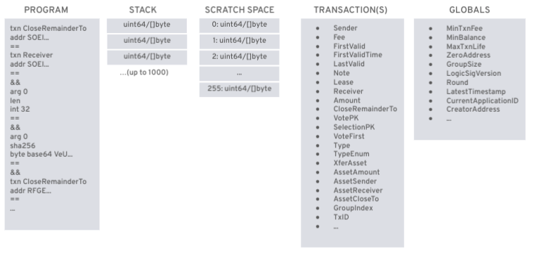
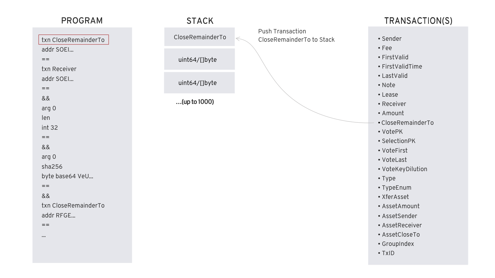
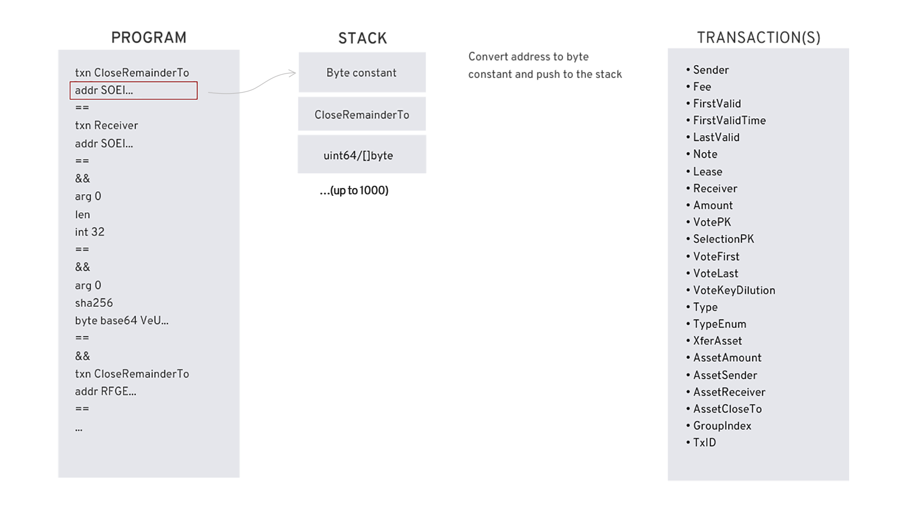
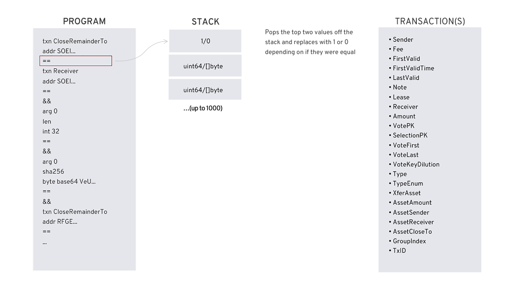
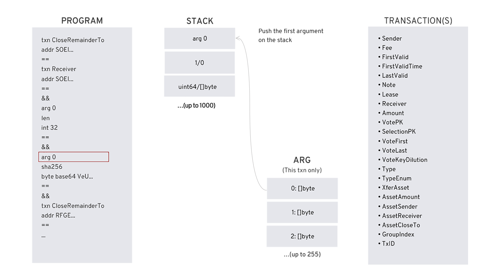
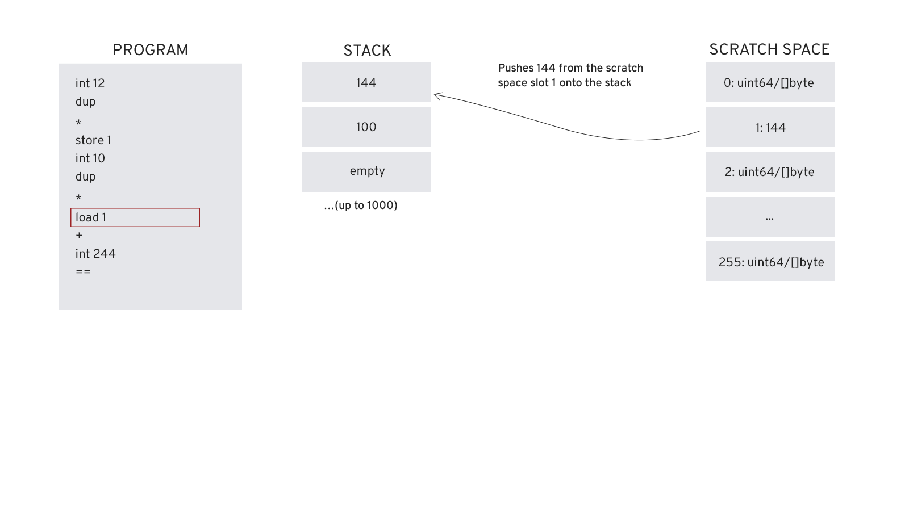

title: TEAL Overview

<center><iframe width="560" height="315" src="https://www.youtube.com/embed/OWFRP9McBmk" frameborder="0" allow="accelerometer; autoplay; encrypted-media; gyroscope; picture-in-picture" allowfullscreen></iframe></center>
<center>*ASC1 Overview*</center>

TEAL is an assembly-like language and is processed with a stack machine. The language is a non-turing-complete language that does not support looping but does support forward branches. TEAL programs are processed one line at a time that push and pop values from the stack. These stack values are either unsigned 64 bit integers or byte strings. TEAL provides a set of operators that operate on the values within the stack. TEAL also allows arguments to be passed into the program from a transaction, a scratch space to temporarily store values for use later in the program, access to grouped or single transaction properties, global values, a couple of pseudo operators, constants and some flow control functions like `bnz` for branching. See TEAL Specification Reference<LINK> for more details.

<center></center>
<center>*TEAL Architecture Overview*</center>

# Getting Transaction Properties
The primary purpose of a TEAL program is to return either true or false. When the program completes if there is a non-zero value on the stack then it returns true and if a zero value or the stack is empty it will return false. If the stack has more than one value the program also returns false. The following digagram illustrates how the stack machine processes the program.

Program line number 1:

<center></center>
<center>*Getting Transaction Properties*</center>

The program uses the `txn` to reference the current transaction lists of properties. Grouped transaction properties are referenced using `gtxn`. The number of transactions in a grouped transaction are availble in the global variable `Group Size`. To get the the first transaction's reciever use `gtxn 0 Receiver`. See TEAL Specification Reference<LINK> for more transaction properties.

# Pseudo Opcodes
The TEAL specification provides several psuedo opcodes for convience.  For example, the second line in the program below uses the `addr` psuedo opcode.

<center></center>
<center>*Pseudo Opcodes*</center>

The `addr` pseudo opcode converts Algorand addresses to a byte constant and pushes the result to the stack. See TEAL Specification Reference<LINK> for additional pseudo opcodes.

# Operators
TEAL provides operators to work with data that is on the stack. For example, the `==` operator evaluates if the last two values on the stack are equal and pushes either a 1 or 0 depending on the result. The number of values used by an operator will depend on the operator. The TEAL Opcodes documentation explains arguments and return values. See TEAL Specification Reference<LINK> for a list of all operators.

<center></center>
<center>*Operators*</center>

# Argument Passing
TEAL supports program arguments. The diagram below illustrates an example of logic that is loading a parameter on to the stack. 

<center></center>
<center>*Arguments*</center>

All argument parameters to a TEAL program are byte arrays. The order that parameters are passed in is specific. In the diagram above, The first parameter is pushed on to the stack. The SDKs provide standard language functions that allow you to convert parameters to a byte array. If you are using the `goal` command line tool, the parameters must be passed as base64 encoded strings. See the parameter section within the ASC1 SDK usage<LINK> documentation and the Goal Teal Walkthrough<LINK> documentation for more details on parameters.

# Storing and Loading from Scratchspace
TEAL provides a scratch space as a way of temporarily storing values for use later in your code. The diagram below illustrates a small TEAL program that loads 12 onto the stack and then duplicates it. These values are multiplied together and result (144) is pushed to the top of the stack. The store command stores the value in the scratch space 1 slot.

<center></center>
<center>*Storing Values*</center>

The load command is used to retrieve a value from the scratch space as illustrated in the diagram below. Note that this operation does not clear the scratch space slot, which allows a stored value to be loaded many times if necessary.

<center></center>
<center>*Loading Values*</center>

# Operational Cost of TEAL Opcodes
TEAL programs are limited to 1000 bytes in size. Size enccompasses the compiled program plus arguments. For optimal performance TEAL programs are also limited in opcode cost. This cost is representative of a TEAL program's computational expense. Every opcode within TEAL has a numeric value that represents it's opcode cost. Most opcodes have an opcode cost of 1. Some operators such as the `SHA256` (cost 7) operator or the `ed25519verify` (cost 1900) operator have substantially larger opcode costs. TEAL programs are limited to 2000 for total opcode cost of all program operators. The TEAL Opcode Reference<LINK> lists the opcode cost for every operator.

# Example Walthrough of a TEAL Program
The example covered in this tutorial is for an contract account TEAL program. The account is set up where all tokens are removed from the account with one successful transaction and delivered to one of two accounts. Unsuccessful transactions leave the funds in the contract account.

The example uses two address (addr1 and addr2). The variables have the values of addr1 = `RFGEHKTFSLPIEGZYNVYALM6J4LJX4RPWERDWYS2PFKNVDWW3NG7MECQTJY` and addr2 = `SOEI4UA72A7ZL5P25GNISSVWW724YABSGZ7GHW5ERV4QKK2XSXLXGXPG5Y`.  The variable addr1 represents the creator of the contact account and funds it. The variable addr2 is the intended recipient of the funds, but only if addr2 supplies a proper secret key and the transaction must be submitted within a time limit (represented with a number of blocks). If addr2 does not submit the transaction in time or can’t supply the proper secret key, addr1 can submit the transaction and retrieve all the tokens. The transaction fee for the transaction is limited to no more than 1 algo. The psuedo code for this example is represented with the following logic:

``` go
((addr2 and secret) || (addr1 and timeout)) && (ok fee)
```

The example uses the `CloseRemainderTo` field to close out the account and move all funds to either addr1 or addr2 on a successful transaction.

The first clause of the pseudo logic is implemented with the following TEAL.

``` go

// Are used to comment in TEAL
// htlc.teal
// Push the CloseRemainderTo property of the current transaction onto the stack
txn CloseRemainderTo

// Push addr2 onto the stack as the intended recipient
addr SOEI4UA72A7ZL5P25GNISSVWW724YABSGZ7GHW5ERV4QKK2XSXLXGXPG5Y

// The == operator is used to verify that both of these are the same
// This pops the two values off the stack and pushes the result 0 or 1
==

// Push the current transaction’s Receiver property onto the stack
// In this example it should be addr2
txn Receiver

// Push addr2 on the stack using the addr constant
addr SOEI4UA72A7ZL5P25GNISSVWW724YABSGZ7GHW5ERV4QKK2XSXLXGXPG5Y

// Use the == to verify that these are equal which pops off the top two values of the stack
// and returns 0 or 1
==

// The stack should currently have two values from the two top conditions
// These will be either 0s or 1s
// Push the && operator which will AND the two previous conditions and return
// either 0 or 1, which leaves one value on the stack either a 0 or a 1
&&

// Push the first argument to the transaction onto the stack
arg 0

// The len operator pops the arg off the stack and 
// pushes the length of the argument onto the stack
len

// Push a constant int of value 46 onto the stack
int 46

// The == operator verifies that the length of the argument
// is equal to 46. This pops the two values and returns a 0 or 1
// The stack now contains two values with a value of 0 or 1
==

// The && operator will AND the two values in the stack
// which pops both values off the stack and returns a 0 or 1
// The stack should now only have one value on the stack, 0 or 1
&&

// arg 0 is pushed back onto the stack
// This represents the hashed passcode
arg 0

// The sha256 operator pops the arg 0 off the stack
// and pushes the hash value of the argument onto the stack
sha256

// The constant byte array of the base64 version of our secret is pushed onto the stack
byte base64 QzYhq9JlYbn2QdOMrhyxVlNtNjeyvyJc/I8d8VAGfGc=

// The == operator pops the two values and push 0 or 1 on to the stack
// If arg0 is equal to the secret this value will be 1 and if not it will be 0
==

// Two values are now on the stack. The && operator is used 
// to pop the last two values and push either 0 or 1
// This will AND all previous conditions to this one.
// The stack should only have a 0 or 1 value now
&&

```
The second clause of the pseudo logic is implemented with the following TEAL.

``` go

// The following six lines of teal check if the 
// transaction is reciever is set to addr1 and that the CloseRemainderTo
// transaction property is also set to addr1.
// Once completed the stack will have the 0 or 1 from the previous clause and a 1 or 0 from the 
// the beginning of the second clause. 
txn CloseRemainderTo
addr RFGEHKTFSLPIEGZYNVYALM6J4LJX4RPWERDWYS2PFKNVDWW3NG7MECQTJY
==
txn Receiver
addr RFGEHKTFSLPIEGZYNVYALM6J4LJX4RPWERDWYS2PFKNVDWW3NG7MECQTJY
==
&&

// The FirstValid parameter from the transaction is pushed onto the stack
txn FirstValid

// The constant int value of 67240 is pushed onto the stack
// This is a hard coded round number and is only used here as an example
int 67240

// The > operator is used to check if First Valid is greater than 67240
// This is used to see if the transaction is timed out and if so addr1 can
// Submit the transaction to return the funds.
// This pops the last two values and returns a 0 or 1
// At the end of this operation, we should have 
// three values on the stack. One for the first clause, and two for the second clause
>

// The && operator is used to AND the last two options in the second clause which pops the
// last two values and pushes a 1 or 0. This will leave only two values on the stack
&&

```
This completes the second clause. Clause 1 and 2 are ORed together.

``` go
// The || operator is pushed onto the stack which ORs
// the first two clauses
// and pops the two values and pushes a 0 or 1 
|| 
```
The third clause is responsibile for verifying that the transaction fee is below 1 Algo. This is an important check to prevent an account being cleared by an errant transaction fee requirement.

```go

// The current transaction fee is pushed onto the stack
txn Fee

// The constant integer of value 1000000 is pushed
// onto the stack, which is specified in micro algos
// In this example this equates to 1 algo
int 1000000 

// The < operator is used to pop those last two values and replace with a 
// 0 or 1. This just verifies that the fee is not greater than 1 algo
// At this point there will be two values on the stack 
<
```
The && is the final operator used in this example. This ANDs the third clause with the result of the OR operation between the first and second clause.

``` go
// The && operator is used to pop those values by anding them and pushing either 
// a 1 or 0
// Since this is the end of the program this value represents the return value
// and determines if the transaction executed successfully 
&&
```

Full example is presented below.
``` go 

txn CloseRemainderTo
addr SOEI4UA72A7ZL5P25GNISSVWW724YABSGZ7GHW5ERV4QKK2XSXLXGXPG5Y
==
txn Receiver
addr SOEI4UA72A7ZL5P25GNISSVWW724YABSGZ7GHW5ERV4QKK2XSXLXGXPG5Y
==
&&
arg 0
len
int 46
==
&&
arg 0
sha256
byte base64 QzYhq9JlYbn2QdOMrhyxVlNtNjeyvyJc/I8d8VAGfGc=
==
&&
txn CloseRemainderTo
addr RFGEHKTFSLPIEGZYNVYALM6J4LJX4RPWERDWYS2PFKNVDWW3NG7MECQTJY
==
txn Receiver
addr RFGEHKTFSLPIEGZYNVYALM6J4LJX4RPWERDWYS2PFKNVDWW3NG7MECQTJY
==
&&
txn FirstValid
int 67240
>
&&
||
txn Fee
int 1000000
<
&&

```
