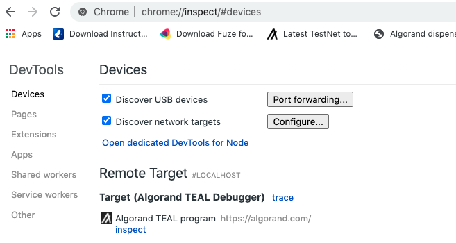
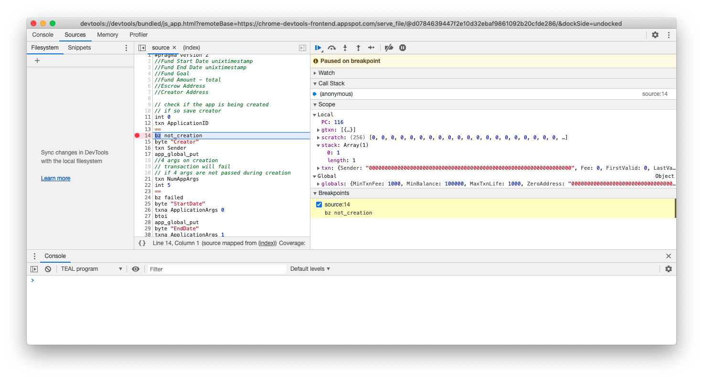
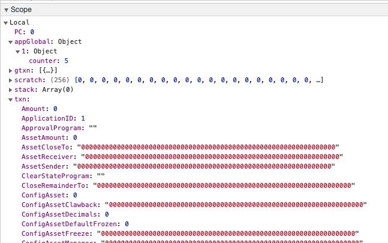

title: Smart contract debugging

Smart contracts can be debugged using two different methods. The first is an interactive debugger that uses the `tealdbg` command-line tool to launch a debug session where the smart contract can be examined as the contract is being evaluated. The second method uses the `goal clerk dryrun-remote` command which outputs a line by line result of the evaluation of the smart contract.  These two methods are described below.

# Using the TEAL debugger
Algorand provides the `tealdbg` command-line tool to launch an interactive session to debug smart contracts. This tool is explained in the project’s [README](https://github.com/algorand/go-algorand/blob/master/cmd/tealdbg/README.md).

This debugger can debug local smart contracts or connect remotely to an on-chain smart contract. The examples below illustrate using the debugger locally, which will be the predominant use case for developers when they are developing smart contracts. For more information on the `tealdbg` utility and how you can use it remotely, see the project’s [README](https://github.com/algorand/go-algorand/blob/master/cmd/tealdbg/README.md) which covers in detail the different debugging options.

The debugger process supports both Chrome Developer Tools and a simple Web Frontend.

To launch the debugger locally, for use with the CDT, execute the following command from a terminal.

```
$ tealdbg debug program.teal
.
.
2020/08/25 14:05:38 CDT debugger listening on: ws://localhost:9392/091d04a69152223ae84c8b40271c3d62f8490ea9b795aae95868932163f89735
2020/08/25 14:05:38 Or open in Chrome:
2020/08/25 14:05:38 devtools://devtools/bundled/js_app.html?experiments=true&v8only=false&ws=localhost:9392/091d04a69152223ae84c8b40271c3d62f8490ea9b795aae95868932163f89735
```

This will launch the debugger process and return an endpoint that is listening for connections. This process can be connected to directly with the Chrome Developer Tools. The simplest way to do this is to enter `chrome://inspect/` into the address bar of the browser, click “Configure” to add “localhost:9392”, and select the Algorand TEAL Debugger in the Remote Target Section (click on the inspect link).


<center>*Configure CDT Remote Connection*</center>

This will launch the debugger and allow the smart contract to be inspected. The debugger provides standard debugger controls, like single-stepping, pausing, breakpoints etc.


<center>*TEAL Debugger*</center>

The Scope pane contains the current stack and is useful for determining what values the current line of code is processing. When a smart contract returns, if anything other than one positive value is left on the stack or the `return` opcode is used with a nonpositive value on the top of the stack, the program will fail. The Scope pane also displays the current transaction with all its properties, the current scratch space, global variables, and any state associated with the contract. If this transaction is part of an atomic transfer, all transactions will also be available in the Scope pane.

When using the command above to launch the debugger most of the scope properties will be empty because no context has been set for the debugging session. To debug most smart contracts adequately, some context will have to be supplied. This can be done by supplying parameters to the `tealdbg` tool. The following context items can be set for a debug session

 - Transaction(s) - Supply one or more transactions to the debug session.
 - Balance Records - Account balance records of accounts used in the contract. Needed when debugging smart contracts that make use of state. 
 - Latest Timestamp - Set the latest timestamp for debugging smart contracts that make use of time values.
 - Protocol - Set the protocol of consensus that the debug session uses when evaluating the contract.
 - Round - Set the current round for the debug session.
Group Index - If using more than one transaction, the specific index that is being processed can be set.
 - Mode - The debugger can debug both smart signatures (Signature) and smart contracts (Application). The mode can be set to determine which type is being processed. By default, the debugger scans the program to determine the type of contract.
 - Application ID - Manually set the application ID of the current smart contract.

The context can also be read directly from an instance of the Indexer. See the `tealdbg` [documentation](https://github.com/algorand/go-algorand/blob/master/cmd/tealdbg/README.md) for more information.

What context is needed for a debug session will depend on the type of contract that is being debugged and what opcodes are used in the program. The primary context that needs to be set for most debug sessions is the transaction(s) being processed and the associated balance records (if debugging a smart contract) of the accounts involved. In most cases using the `--dryrun-dump` option with `goal` will get all the context needed for a debug session. See the following sections that show how to debug smart contracts supplying the proper context. To learn more about setting individual context items, see the `tealdbg` [documentation](https://github.com/algorand/go-algorand/blob/master/cmd/tealdbg/README.md).

## Setting the debugger context
For most smart contracts, the balance records for all accounts that the contract interacts with for a specific transaction should be supplied. Additionally, at least the transaction calling the smart contract should be supplied. The `goal` command-tool provides the `--dryrun-dump` option when using the `goal clerk send` or `goal app` call that generates the needed context.  By default, the `--dryrun-dump` option will output the data in JSON format. This can be changed to MessagePack format if needed by using the `--dryrun-dump-format` option. The examples below show exporting the context.

```
// getting transactions
$ goal app call --app-id {appid} --from {ACCOUNT} --out=dumptx.dr --dryrun-dump
$ goal clerk send --from={ACCOUNT} --to=“{RECEIVER}” --amount=500000 --out=statefultx.dr --dryrun-dump
```

This context can be used with the `tealdbg` command by supplying the `--dryrun-req` option.

```
$ tealdbg debug program.teal --dryrun-req statefultx.dr
```

!!! note "a note on supplying the Teal code"
    The `tealdbg` command does not require the Teal program above as the decompiled version is available in the dryrun-req dump file. In this example it is supplied for easier readability while in the debugger. Supplying the program will allow debugging the original source and not the decompiled version.

The scope panel will now have the proper context data for the debugging session.


<center>*TEAL Debugger Scope*</center>

One or more transactions that are stored in a file can be debugged by dumping the context data with the `goal clerk dryrun` command. For example, two smart contracts are grouped below and the context data is generated using the `dryrun-dump` option. The `tealdbg` command is then used to start the debugger.

```
#generate calls
$ goal app call --app-id 1  --app-arg "str:test1" --from [ACCOUNT] --out=unsginedtransaction1.tx  
$ goal app call --app-id 1  --app-arg "str:test2" --from [ACCOUNT] --out=unsginedtransaction2.tx

# atomically group them
$ cat unsginedtransaction1.tx unsginedtransaction2.tx  > combinedtransactions.tx
$ goal clerk group -i combinedtransactions.tx -o groupedtransactions.tx 
$ goal clerk split -i groupedtransactions.tx -o split.tx 

# sign individual transactions
$ goal clerk sign -i split-0.tx -o signout-0.tx
$ goal clerk sign -i split-1.tx -o signout-1.tx 

# concatenate the two signed transactions
$ cat signout-0.tx signout-1.tx  > signout.tx

# generate context debug file
$ goal clerk dryrun -t signout.tx --dryrun-dump  -o dr.msgp

# debug first transaction. Change index to 1 to debug second transaction
$ tealdbg debug program.teal -d dr.msgp --group-index 0
```

!!! warning
	Currently the `--dryrun-dump` and `-o` flags are not implemented in release but will be available shortly.

Debugging a stateless smart contract functions identically to the process described above except the state is not required. For example, a stateless contract may act as an escrow account. The following call exports the transaction for debugging purposes. This call will not execute on the blockchain as it is not submitted to the network but is written to the output file.

```
$ goal clerk send -a=0 -c=[ACCOUNT_1] --to=[ACCOUNT_2] --from-program=stateless.teal --out=statelesstx.tx --dryrun-dump
```

This contract can then be debugged by using the following command.

```
$ tealdbg debug stateless.teal -d statelesstx.tx
```

The `tealdbg` utility has many more options for setting specific context items. For information on these capabilities, see the project’s [README](https://github.com/algorand/go-algorand/blob/master/cmd/tealdbg/README.md).


# Using dryrun for debugging a TEAL program

The SDKs and the `goal` command-line tool provide the functionality to do a test run of a TEAL smart contract.

When using the `goal` command-line tool, the --out option is used to write a signed transaction out to a file and the transaction will not be submitted to the network. You can also generate a dryrun-dump file as described in [Setting The Debugger Context](#setting-the-debugger-context) to not only capture the transaction in the output file but the associated state of a smart contract. This allows testing of the TEAL logic with the `goal clerk dryrun-remote` command which shows how the TEAL is processed and approved or rejected.

The SDKs support debugging with the dryrun REST API. The dryrun response to this REST API includes disassembly, logic sig messages w PASS/REJECT, a sig trace, app call messages, and an app call trace.

!!! important "enabling dryrun-remote"
    The dryrun REST API is only available on a node if it has been enabled in the node's configuration. This can be done using the following commands.

    ```
    $ algocfg set -p EnableDeveloperAPI -v true
    $ goal node restart
    ```

=== "JavaScript"
	```javascript
    // dryrunDebugging returns a response with disassembly, logic-sig-messages w PASS/REJECT and sig-trace
    async function dryrunDebugging(lsig, txn, data) {
        if (data == null)
        {
            //compile
            txns = [{ lsig: lsig, txn: txn }];        
        }
        else
        {
            // source
            txns = [{
                txn: txn,
            }];
            sources = [new algosdk.modelsv2.DryrunSource("lsig", data.toString("utf8"), 0)];
        }
        const dr = new algosdk.modelsv2.DryrunRequest({
            txns: txns,
            sources: sources,
        });
        dryrunResponse = await algodclient.dryrun(dr).do();
        return dryrunResponse;
    }
    ```

=== "Python"
	```python
    # dryrun_debug returns a response with disassembly, logic-sig-messages w PASS/REJECT and sig-trace
    # dryrun source if provided, else dryrun compiled
    def dryrun_debug(lstx, mysource):
        sources = []
        if (mysource != None):
            # source
            sources = [DryrunSource(field_name="lsig", source=mysource, txn_index=0)]
        drr = DryrunRequest(txns=[lstx], sources=sources)
        dryrun_response = algod_client.dryrun(drr)
        return dryrun_response
    ```

=== "Java"
	```java
    // getDryrun returns a response with disassembly, logic-sig-messages w PASS/REJECT and sig-trace
    private Response<DryrunResponse> getDryrunResponse(SignedTransaction stxn, byte[] source)
            throws Exception{
        List<DryrunSource> sources = new ArrayList<DryrunSource>();
        List<SignedTransaction> stxns = new ArrayList<SignedTransaction>();
        // compiled 
        if (source == null) {
            stxns.add(stxn);
        }
        // source
        else if (source != null) {
            DryrunSource drs = new DryrunSource();
            drs.fieldName = "lsig";
            drs.source = new String(source);
            drs.txnIndex = 0l;
            sources.add(drs);
            stxns.add(stxn);
        }
        Response<DryrunResponse> dryrunResponse;
        DryrunRequest dr = new DryrunRequest();
        dr.txns = stxns;
        dr.sources = sources;
        dryrunResponse = client.TealDryrun().request(dr).execute();
        return dryrunResponse;
    } 
    ```

=== "Go"
	```go
    // dryrunDebugging returns a response with disassembly, logic-sig-messages w PASS/REJECT and sig-trace
    func dryrunDebugging(lsig types.LogicSig, args [][]byte,tealFile []byte, client *algod.Client) modelsV2.DryrunResponse {
        // if tealFile is nil, use compile
        txns := []types.SignedTxn{{}}
        sources := []modelsV2.DryrunSource{}
        if (tealFile == nil){
            // complile
            txns[0].Lsig = lsig    
        }else{
            // source
            txns[0].Lsig.Args = args
            sources = append(sources, modelsV2.DryrunSource{
                FieldName: "lsig",
                Source:    string(tealFile),
                TxnIndex:  0,
            })
        }

        ddr := modelsV2.DryrunRequest{
            Txns:    txns,
            Sources: sources,
        }

        result, err := client.TealDryrun(ddr).Do(context.Background())
        if err != nil {
            return result
        }
        return  result
    }

    ```

The response should look similar to this:

```json
{
     "protocol-version": "https://github.com/algorandfoundation/specs/tree/e5f565421d720c6f75cdd186f7098495caf9101f",
     "txns": [
     {
         "disassembly": [
             "// version 1",
             "intcblock 123",
             "arg_0",
             "btoi",
             "intc_0",
             "==",
             ""
         ],
         "logic-sig-messages": [
             "PASS"
         ],
         "logic-sig-trace": [
             {
                 "line": 1,
                 "pc": 1
             },
             {
                 "line": 2,
                 "pc": 4
             },
             {
                 "line": 3,
                 "pc": 5,
                 "stack": [
                     {
                         "bytes": "AAAAAAAAAHs=",
                         "type": 1
                     }
                 ]
             },
             {
                 "line": 4,
                 "pc": 6,
                 "stack": [
                     {
                         "type": 2,
                         "uint": 123
                     }
                 ]
             },
             {
                 "line": 5,
                 "pc": 7,
                 "stack": [
                     {
                         "type": 2,
                         "uint": 123
                     },
                     {
                         "type": 2,
                         "uint": 123
                     }
                 ]
             },
             {
                 "line": 6,
                 "pc": 8,
                 "stack": [
                     {
                         "type": 2,
                         "uint": 1
                     }
                 ]
             }
         ]
      } 
   ]
}   
```

To make the same request via the commandline use goal:

=== "goal"
	```bash
    $ goal app call --app-id 1  --app-arg "str:test1" --from [SENDER_ACCOUNT] --out=dump.dr --dryrun-dump
    $ goal app clerk dryrun-remote -D dump.dr --verbose
    ```

    Output

    ```text
        tx[0] messages:
        ApprovalProgram
        PASS
        tx[0] trace:
        1 (0001): // version 2 []
        2 (0006): intcblock 6 1 0 []
        3 (0010): bytecblock 0x636f756e746572 []
        4 (0012): txn TypeEnum [6]
        5 (0013): intc_0 [6 6]
        6 (0014): == [1]
        7 (0017): bz label1 []
        8 (0018): bytec_0 [Y291bnRlcg==]
        9 (0019): dup [Y291bnRlcg== Y291bnRlcg==]
        10 (001a): app_global_get [Y291bnRlcg== 1]
        11 (001b): intc_1 [Y291bnRlcg== 1 1]
        12 (001c): + [Y291bnRlcg== 2]
        13 (001d): dup [Y291bnRlcg== 2 2]
        14 (001f): store 0 [Y291bnRlcg== 2]
        15 (0020): app_global_put []
        16 (0022): load 0 [2]
        20 (0025): return [2]
    ```


!!! info
    The example code snippets are provided throughout this page and are abbreviated for conciseness and clarity. Full running code examples for each SDK are available within the GitHub repo at [/examples/smart_contracts](https://github.com/algorand/docs/tree/master/examples/smart_contracts) and for [download](https://github.com/algorand/docs/blob/master/examples/smart_contracts/smart_contracts.zip?raw=true) (.zip)

