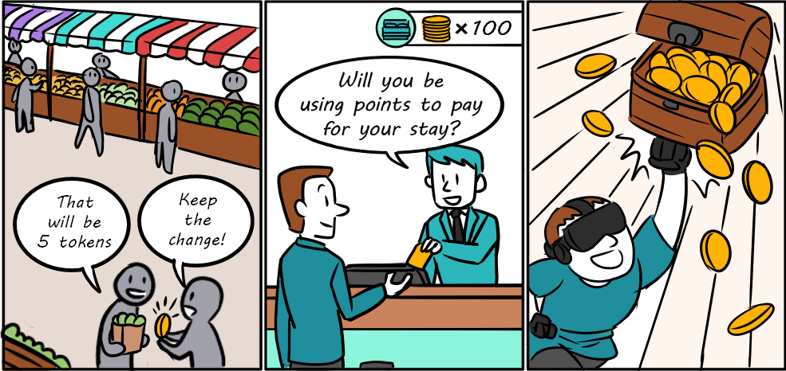

title: Create a fungible token

# What are fungible tokens?
Fungible tokens, or FTs for short, are a type of asset split into multiple units that are fundamentally the same and interchangeable one-to-one with each other. Algos are fungible, but since they are also a utility token for the Algorand network, they are implemented differently from the types of fungible tokens we’ll talk about in this guide.

<center>
{: style="width:500px" align=center }
<figcaption style="font-size:12px">Examples of fungible token use cases: local currencies, travel program loyalty points, in-game tokens.</figcaption>
</center>

Loyalty programs that offer reward points that can be traded in for merchandise or services are considered fungible. Fiat currencies are fungible and can be represented on the blockchain as stablecoins (a token that maintains a steady value usually by having backed reserves or through some stabilization algorithms) or by direct issuance on the blockchain (central bank digital currencies). Tokenized shares in real estate, a company, or a fund are usually fungible too.

Tokenizing a fungible asset is an onramp to all the benefits of a blockchain ecosystem that we learned about in the first section of this getting started guide (security, trust, immutability, efficiency, low costs, composability).

# How to create fungible tokens
Fungible tokens, like NFTs, are implemented as Algorand Standard Assets (ASAs). Also like NFTs, you do not need to write smart contract code. You just need to specify a few parameters to identify it as an FT (e.g. total count is greater than 1) and attach metadata so that potential owners have the information they need to validate the integrity of the asset. The relevant code snippet in each of the SDKs is as follows:

=== "Python"
    ```python
    txn = AssetConfigTxn(sender=accounts[1]['pk'],
                         sp=params,
                         total=10000,			// Fungible tokens have totalIssuance greater than 1
                         default_frozen=False,
                         unit_name="ALICE",
                         asset_name="Alice's Coins@arc3",
                         manager="",
                         reserve="",
                         freeze="",
                         clawback="",
                         url="https://path/to/my/fungible/asset/metadata.json",
                         metadata_hash=json_metadata_hash,
                         decimals=2)			// Fungible tokens typically have decimals greater than 0
    ```

=== "JavaScript"
    ```javascript
    ```

=== "Java"
    ```java
    ```

=== "Go"
    ```go
    creator := account.Address.String()
	assetName := "Alice's Coins@arc3"
	unitName := "ALICE"
	assetURL := "https://path/to/my/fungible/asset/metadata.json"
	assetMetadataHash := metadataHash
	totalIssuance := uint64(10000)  // Fungible tokens have totalIssuance greater than 1
	decimals := uint32(2)           // Fungible tokens typically have decimals greater than 0
	manager := ""
	reserve := ""
	freeze := ""
	clawback := ""
	defaultFrozen := false
	note := []byte(nil)

    	txn, err := transaction.MakeAssetCreateTxn(
		creator, note, txParams, totalIssuance, decimals,
		defaultFrozen, manager, reserve, freeze, clawback,
		unitName, assetName, assetURL, assetMetadataHash)

    ```

Let’s imagine that Alice wants to create a loyalty point program for her buyers. She’ll represent these points as a fungible asset on Algorand and will call it AliceCoin. Owners of AliceCoin can use them to buy future artwork or trade it in for priority access to some of Alice’s art events. Let’s mint AliceCoin on TestNet. We will use the Algorand Foundation’s proposed [ARC-0003](https://github.com/algorandfoundation/ARCs/blob/main/ARCs/arc-0003.md) FT standard. 

=== "Python"
    [Run code](https://replit.com/@Algorand/CreateFTPython/){: target="_blank"}

=== "JavaScript"
    [Run code](https://replit.com/@Algorand/CreateFTJavaScript/){: target="_blank"}

=== "Java"
    [Run code](https://replit.com/@Algorand/CreateFTJava/){: target="_blank"}

=== "Go"
    [Run code](https://replit.com/@Algorand/CreateFTGo/){: target="_blank"}

# Other fungible token resources 
- [Search the developer blog](../../../../blog/?query=fts){: target="blank"} for more FT-related guides, code prototypes, and explanations from the community.
- [Browse community tools and projects](../../../../ecosystem-projects/?tags=fts){: target="blank"} related to NFTs.
- Detailed documentation on [Algorand Standard Assets (ASAs)](../../../get-details/asa/){: target="blank"} and related [transaction types](../../../get-details/transactions/#asset-configuration-transaction){: target="blank"}.

