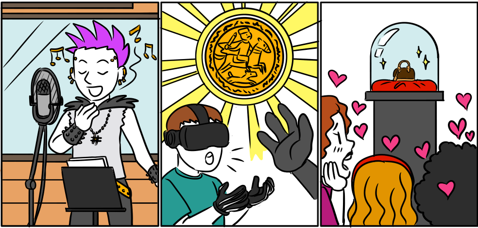

title: Create an NFT

# What are NFTs?

Non-fungible tokens, or NFTs for short, are unique assets represented on the blockchain. Digital art and collectibles are types of NFTs that you may have heard about, but they only scratch the surface of what is possible. 

<center>
{: style="width:500px" align=center }
<figcaption style="font-size:12px">Examples of NFT use cases: Tokenizing the rights to a song to facilitate royalty payments, in-game collectibles, or special edition brand merchandise.</figcaption>
</center>

Remember that Alice wants to use blockchain to help her scale and grow her business, because it provides important properties that she cannot achieve otherwise (trust, transparency, efficiency, low costs). The first step for her is to represent her unique art pieces on-chain as NFTs. Let's go ahead and learn how to create an NFT on Algorand.

Learn more about NFTs from Algorand's Chief Product Officer: 

> [The Enduring Value of NFTs on Algorand: A Critical Role in the Future of Finance](https://www.algorand.com/resources/blog/the-enduring-value-of-nfts-on-algorand){: target="blank"}

# How to create NFTs
NFTs are created using Algorand Standard Assets (ASAs), which are built into the protocol and activated using a special type of transaction. You do not need to write smart contract code, which may be the case on some other blockchains. You just need to specify a few parameters to identify it as an NFT (e.g. total count of 1) and attach metadata so that potential owners have the information they need to validate the integrity of the asset. The relevant code snippet in each of the SDKs is as follows:

=== "JavaScript"
    ```
    ```

=== "Python"
    ```
    ```

=== "Java"
    ```
    ```

=== "Go"
    ```
    ```

Now let's go ahead and create Alice’s NFT. We will use the Algorand Foundation’s proposed [ARC-0003](https://github.com/algorandfoundation/ARCs/blob/main/ARCs/arc-0003.md) NFT standard. Choose your favorite SDK to run the full code example for creating an NFT on TestNet and watch the step-by-step video guide.

|JS|Python|Java|Go|
|---|---|---|---|
|[{: width='24px' } Run code](https://replit.com/@Algorand/CreateNFT#main.py){: target="_blank"}|[{: width='24px' } Run code](https://replit.com/@Algorand/CreateNFT#main.py){: target="_blank" }|[{: width='24px' } Run code](https://replit.com/@Algorand/CreateNFT#main.py){: target="_blank" }|[{: width='24px' } Run code](https://replit.com/@Algorand/CreateNFT#main.py){: target="_blank" }|
|[{: width='24px' } Play video](){: target="_blank"}| [{: width='24px' } Play video](){: target="_blank" }| [{: width='24px' } Play video](){: target="_blank" }|[{: width='24px' } Play video](){: target="_blank" }|

Once created, the asset will have a unique ID on the Algorand blockchain. If you ran the code above, you can use a [block explorer](../../../ecosystem-projects/?tags=block-explorers) to find your newly created NFT on TestNet.

<center>
{: style="width:500px"}
<figcaption style="font-size:12px">Alice tokenizes her art piece as an NFT on Algorand.</figcaption>
</center>

**Composability**

ASAs can be composed with other features on Algorand (like smart contracts) and with applications built on top of Algorand. What makes this possible is the combination of the standard representation of an NFT on the Algorand blockchain, both as an ASA and specifically as a unique ASA, and the openness and permissionless nature of the Algorand blockchain. The fact that you can immediately look up the asset you created on TestNet on any block explorer is a small example of composability in action. 

# Fractional NFTS

A fractional NFT is a unique asset that has been divided into multiple, equal shares. Why do this? When NFTs are selling for millions of dollars, this may be one way to lower the bar for entry and reach more potential buyers who would not have been able to invest in the whole NFT. The other side of the coin (pun intended) is that by increasing your pool of potential buyers, you may see the value of your NFT increase. Need a compelling example? In September 2021, the owner of a meme Doge NFT who paid 4 million dollars for it, fractionalized it and then auctioned off a portion of those fractional shares at a price that revalued their asset at 225 million USD[^1].

[^1]: [https://www.theblockcrypto.com/linked/116464/fractionalized-doge-nft-valued-at-225-million-after-sushiswap-auction](https://www.theblockcrypto.com/linked/116464/fractionalized-doge-nft-valued-at-225-million-after-sushiswap-auction){: target="_blank"}

Maybe Alice should think about fractionalizing her artwork for her next auction!
 
To create a fractional NFT, keep the total value of the ASA at 1 and use the decimal field to split it into the desired number of shares (must be powers of 10). The fractional NFT standard is defined as part of [ARC-0003](https://github.com/algorandfoundation/ARCs/blob/main/ARCs/arc-0003.md){: target="_blank"}

=== "JavaScript"
    ```
    ```

=== "Python"
    ```
    ```

=== "Java"
    ```
    ```

=== "Go"
    ```
    ```

# More NFT Resources

- [Search the developer blog](../../../blog/?query=nfts){: target="blank"} for more NFT-related guides, code prototypes, and explanations from the community.
- [Browse community tools and projects](../../../ecosystem-projects/?tags=nfts){: target="blank"} related to NFTs.
- Detailed documentation on [Algorand Standard Assets (ASAs)](../../../get-details/asa/){: target="blank"} and related [transaction types](../../../get-details/transactions/#asset-configuration-transaction){: target="blank"}.
